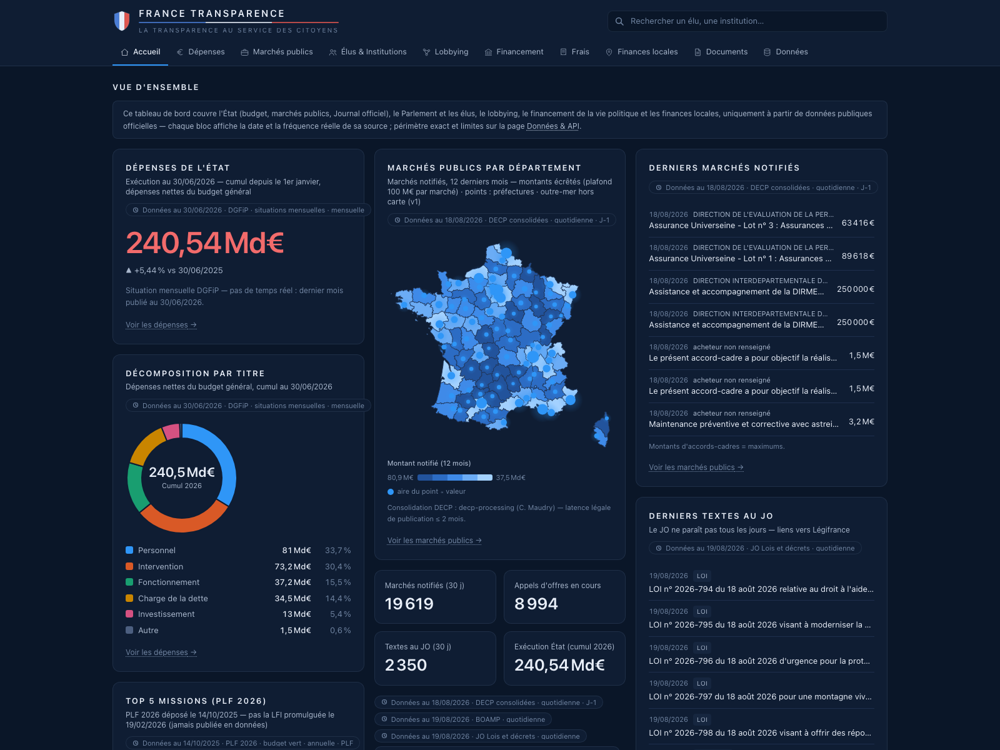

# France Transparence

Dashboard web sur la transparence de la vie politique française : dépenses de l'État, commande publique, élus, lobbying, financement politique, frais et train de vie, Journal officiel — **100 % données publiques réelles**, aucun chiffre fabriqué. L'honnêteté est le principe produit : chaque module affiche la date réelle de ses données (badge de fraîcheur alimenté par la table `meta_sources`), le mot « en direct » est banni parce qu'aucune source publique ne le permet, et ce que l'open data ne contient pas est documenté comme tel (la « boîte noire » du module Frais & train de vie). L'ensemble tient dans une base SQLite unique, reconstruite localement depuis 28 sources officielles tracées.



## Site public

**https://francetransparence.fr**

Export statique du dashboard, servi **directement par nginx** depuis un serveur dédié (Scaleway Dedibox, Ubuntu 22.04). **Aucun process Node en production** : le HTML est pré-rendu au build, nginx ne fait que servir des fichiers déjà écrits sur disque (et déjà compressés).

Le site est reconstruit chaque matin vers 05:17 (heure de Paris) par le script serveur `ft-deploy`, déclenché par la minuterie systemd `ft-deploy.timer`. La publication est **tout ou rien** : mise à jour du dépôt → contrôle de l'identité de déploiement → ingestion de tous les pipelines → tests → build statique → contrôles de santé du site généré → **bascule atomique** du lien symbolique `current` vers la nouvelle release. Si une étape échoue, le lien ne bascule pas : l'ancienne version continue d'être servie sans interruption, et une alerte part. La fraîcheur affichée reste donc toujours celle de la base réellement construite.

Les cinq dernières releases sont conservées sur le serveur : `ft-rollback` revient à l'une d'elles en quelques secondes, sans rebuild.

```bash
make build-static   # export statique local (FT_EXPORT=1 → app/out/)
make serve-static   # sert app/out/ sur http://localhost:3620
```

L'ancienne adresse GitHub Pages ne sert plus le site : elle ne porte plus qu'une **page de redirection canonique** vers le domaine (`pages-redirection/`). Publier une copie intégrale du site sur les deux hôtes aurait fait vivre deux sites identiques en ligne et partagé l'autorité de référencement de chacune des ~1 066 pages entre deux domaines ; GitHub Pages ne sachant pas émettre de 301, la canonique et le rafraîchissement méta sont les seuls instruments disponibles.

**La CI GitHub Actions ne publie plus le site**, et ce n'est pas une perte : elle valide chaque jour (cron 04:45 UTC) la chaîne complète — ingestion de tous les pipelines dans une base neuve, tests, build, contrôles de santé — dans un environnement neuf, **indépendant du serveur**. Si une source amont casse, on l'apprend là avant que le serveur ne rebuilde. Elle vérifie aussi chaque proposition de fusion **avant** qu'elle n'atteigne `main`, puisque c'est `main` qui alimente le serveur.

L'identité de déploiement est **paramétrable au build** : un fork change d'adresse sans toucher une ligne de source. `NEXT_PUBLIC_SITE_URL` (défaut `https://francetransparence.fr`) porte l'URL du site — canoniques, sitemap et `robots.txt` en sont dérivés (`app/src/app/robots.ts` génère le `robots.txt`, il n'y a plus de fichier statique), et les variables `NEXT_PUBLIC_HEBERGEUR_*` portent l'identité de l'hébergeur publiée dans les mentions légales (`app/src/lib/hebergeur.ts`).

Hébergement : serveur dédié — donc payant, contrairement à la première mise en ligne sur GitHub Pages.

Décision d'hébergement et limites : [docs/deploiement/DECISION.md](docs/deploiement/DECISION.md) · exploitation quotidienne : [docs/deploiement/RUNBOOK.md](docs/deploiement/RUNBOOK.md) · ce qui exige encore un humain : [docs/ACTIONS-HUMAINES.md](docs/ACTIONS-HUMAINES.md).

## Démarrage rapide

Prérequis : `python3.14`, Node.js ≥ 24, `make`.

```bash
make venv         # crée .venv (requests, duckdb, pytest)
make ingest       # reconstruit data/france.db — ~5-10 min, de l'ordre de 1 Go
                  # de téléchargements (703 Mo de bruts gardés en cache dans data/raw)
make app-install  # npm install dans app/
make dev          # http://localhost:3620
```

Production : `make build` puis `cd app && npm run start` (port 3620 dans les deux cas).

La base `data/france.db` (447 Mo, 51 tables) est gitignorée : elle se reconstruit entièrement par `make ingest`.

## Ré-ingérer

`make ingest` est rejouable à volonté : les téléchargements sont mis en cache dans `data/raw` et chaque pipeline remplace proprement ses tables. Pour rejouer un seul pipeline :

```bash
make ingest-<source>
```

avec `<source>` parmi les pipelines déclarés dans la variable `PIPELINES` du `Makefile`, qui fait autorité : `referentiels`, `budget_mensuel`, `budget_structure`, `decp`, `boamp`, `approch`, `jorf`, `parlement`, `integrite`, `hatvp_declarations`, `lobbying`, `financement`, `collectivites`, `elections`, `trainvie`, `cada`, `registre_ue`.

## Tests

```bash
make test         # suite pytest complète
```

Les tests de transformation tournent hors ligne sur des extraits réels figés dans `pipelines/tests/fixtures/` (pièges d'encodage inclus). Les tests d'intégration qui touchent le réseau portent le marqueur `reseau` — les exclure avec `pytest -m 'not reseau'`.

## Architecture

1. `pipelines/` (Python 3.14 + requests + DuckDB) télécharge les sources officielles dans `data/raw/` et les transforme ;
2. tout aboutit dans **une seule base SQLite**, `data/france.db` — le fichier est le contrat entre Python et Next ;
3. chaque ingestion réussie écrit sa ligne dans **`meta_sources`** (date des données, date d'ingestion, fréquence, licence, compte de lignes) : la fraîcheur est une donnée de premier rang, jamais un texte décoratif ;
4. l'app Next.js 16 (App Router, Tailwind 4, better-sqlite3) lit la base **en lecture seule**, sans aucun fetch externe au runtime ;
5. chaque page affiche son badge « Données au JJ/MM/AAAA · source · fréquence » depuis `meta_sources` ;
6. base absente = message « base non construite, lancer make ingest » — jamais de placeholder chiffré.

Le site public est l'export statique de cette même app (`make build-static`, `FT_EXPORT=1`) : toutes les pages sont pré-rendues au build, les filtres et la recherche tournent côté navigateur (index JSON pré-généré, fragments `/data/*.json`), et les anciennes routes API paramétriques sont remplacées par des exports `.json` quotidiens datés.

Détails : [docs/ARCHITECTURE.md](docs/ARCHITECTURE.md).

## Modules du dashboard

| Route | Module | Contenu et fraîcheur réelle |
|---|---|---|
| `/` | Accueil | Compteurs, carte des marchés, flux JO et alertes — chaque bloc daté par sa source (budget au 30/06/2026, marchés J-1, JO du jour). |
| `/depenses` | Dépenses de l'État | Exécution mensuelle DGFiP (données au 30/06/2026, ~6 semaines de décalage), structure PLF 2026 (mention « PLF » : la LFI 2026 n'existe pas en données), 112 722 subventions aux associations (versements 2023). |
| `/marches` | Commande publique | 586 229 marchés consolidés (quotidien, notifications J-1, consolidation légale ≤ 2 mois), 9 011 appels d'offres en cours (BOAMP, jour même), 4 060 achats à venir (APProch). |
| `/elus` | Élus & institutions | 36 018 élus (RNE du 11/08/2026, trimestriel) dont 577 députés et 348 sénateurs (open data AN/Sénat/Datan, quotidien). |
| `/elus/[id]` | Fiche élu | 1 053 fiches statiques (parlementaires et présidences d'exécutifs départementaux/régionaux — les autres élus restent dans les listes et agrégats) : mandats, 30 derniers votes sur les 8 434 scrutins AN (dernier : 21/07/2026, vacances parlementaires), scores Datan crédités, lien HATVP. |
| `/lobbying` | Lobbying | Répertoire HATVP des représentants d'intérêts (quotidien) : entités inscrites, activités déclarées, dépenses par exercice annuel en fourchettes, croisement avec les marchés publics. Puis, dans un bloc **cloisonné** en fin de page, le registre de transparence de l'Union européenne (quotidien) : organisations inscrites, dont celles à siège en France. Deux registres, deux cadres juridiques — jamais fusionnés, jamais comparés. |
| `/financement` | Financement politique | Comptes des partis, exercice 2024 (publié le 10/02/2026 — le dernier possible) ; comptes de campagne des législatives 2024, 4 010 candidats (municipales 2026 : aucun compte publié à ce jour, instruction CNCCFP en cours). |
| `/frais` | Frais & train de vie | 56 faits chiffrés sourcés (barèmes au 01/01/2026, contrôles exercice 2024, Élysée audité 2024) + 8 opacités documentées — pas de notes de frais : elles ne sont ni publiées ni communicables. **Carte des verrous** : 60 941 avis et conseils de la CADA de 1984 à 2024, dépouillés en agrégats (qui refuse, sur quel fondement, et dans quel sens la commission tranche), avec les 28 mois de retard de versement de la source affichés en clair. |
| `/collectivites` | Finances locales | Comptes OFGL 2025 (provisoires, chargés en juillet 2026), dotations DGF 2018-2026, carte en €/habitant. |
| `/documents` | Journal officiel | 2 778 textes des 30 derniers JO (quotidien, JO du jour disponible vers 00h30), filtres lois/décrets/nominations. |
| `/alertes` | Alertes transparence | 1 590 alertes sur 8 types, chacune avec sa règle de calcul et sa base légale, recalculées à chaque ingestion. |
| `/donnees` | Données & exports | Catalogue des 28 sources avec fraîcheur mesurée (le moniteur de santé des sources), licences, règles des alertes, 6 exports JSON statiques (méta, alertes, élus, budget mensuel, agrégats marchés, index de recherche) reconstruits à chaque publication. |

Les volumes chiffrés de ce tableau sont un **instantané daté du 19/08/2026** : la plupart des sources publient quotidiennement, ces nombres bougent donc à chaque ingestion. La seule valeur qui fait foi est celle affichée par le site lui-même, avec la date de ses données — c'est le rôle du badge de fraîcheur et de la page `/donnees`.

## Sources & licences

Sources majeures (le catalogue complet et daté est sur la page `/donnees` et dans [docs/SOURCES.md](docs/SOURCES.md)) :

| Source | Fraîcheur | Licence |
|---|---|---|
| DECP consolidées — data.gouv.fr, consolidation `decp-processing` (Colin Maudry) | quotidienne | Licence Ouverte 2.0 |
| BOAMP — annonces de marchés (DILA) | quotidienne | etalab-2.0 |
| Journal officiel JORFSIMPLE (DILA) | quotidienne | Licence Ouverte (fr-lo) |
| HATVP — répertoire des représentants d'intérêts AGORA | quotidienne | Licence Ouverte Etalab |
| HATVP — liste des déclarations publiées | hebdomadaire | Licence Ouverte Etalab |
| Open data Assemblée nationale (députés, scrutins) | quotidienne | Licence Ouverte |
| Open data Sénat (sénateurs) | quotidienne | Licence Ouverte |
| Datan — scores de participation/loyauté des députés | quotidienne | Licence Ouverte (fr-lo) |
| DGFiP — situations mensuelles budgétaires (data.economie) | mensuelle | Licence Ouverte 2.0 |
| PLF 2026 budget vert, PLF 2025, jaune associations (data.economie) | annuelle | Licence Ouverte 2.0 |
| Répertoire national des élus (ministère de l'Intérieur) | trimestrielle | Licence Ouverte 2.0 |
| OFGL — comptes des collectivités et dotations | annuelle | Licence Ouverte 2.0 |
| CNCCFP — comptes des partis et comptes de campagne | annuelle / par scrutin | Licence Ouverte |
| geo.api.gouv.fr, france-geojson, populations INSEE | statique / annuelle | Licence Ouverte |
| CADA — avis et conseils (ensemble consolidé, agrégats seulement) | irrégulière (lots, 2 à 4 fois par an) | Licence Ouverte (fr-lo) |

Crédits : consolidation DECP par le projet communautaire `decp-processing` de Colin Maudry ; scores calculés par Datan (datan.fr, méthodologie liée dans l'UI) ; DILA (BOAMP, JORF, annuaire, référentiel de l'organisation de l'État) ; HATVP ; CADA ; OFGL ; INSEE ; CNCCFP ; DGFiP / data.economie.gouv.fr ; fonds de carte france-geojson (Grégoire David) et contours Etalab. Toutes les réutilisations mentionnent leur source, conformément à la Licence Ouverte.

## Limites connues

Assumées et affichées dans l'interface — l'honnêteté est le principe produit :

- **Budget de l'État** : publication mensuelle avec ~6 semaines de décalage (données au 30/06/2026 constatées le 19/08). Aucun flux Chorus temps réel n'existe en open data.
- **Notes de frais parlementaires** : ni publiées ni communicables (ord. 58-1100, CE mars 2025, refus écrits AN/Sénat du 11/06/2026) → le module Frais & train de vie est pédagogique : barèmes exacts, contrôles agrégés, opacités documentées.
- **Montants d'accords-cadres** : ce sont des maximums contractuels, pas des paiements — libellés « marchés notifiés », jamais « dépensé ».
- **DECP** : latence légale de publication jusqu'à 2 mois — mention « en cours de consolidation » partout où le flux apparaît.
- **Lobbying** : la donnée HATVP ne sépare pas AN et Sénat (« Parlement » agrégé) et les dépenses sont déclarées par exercice annuel. Le registre européen, lui, ne publie aucun identifiant national d'entreprise (ni SIREN, ni TVA) : aucun rapprochement automatique n'est possible entre les deux registres, et aucun n'est tenté.
- **Comptes locaux 2025** : provisoires (chargés en juillet 2026, ~97 communes manquantes jusqu'en décembre 2026).
- **Outre-mer** : hors rendu de la carte (présent dans les tableaux et agrégats).
- **Scrutins du Sénat** : non ingérés à ce jour (le dump Dosleg n'est pas exploité).

## Contribuer

Signaler une donnée fausse (avec source officielle), proposer une source, corriger du code : [CONTRIBUTING.md](CONTRIBUTING.md). Une faille de sécurité se signale en privé, jamais par issue publique : [SECURITY.md](SECURITY.md).

## Rapport de mission

Construction, méthode multi-agents, corrections d'honnêteté en cours de route et ce qui n'est pas ingéré à ce jour : [docs/RAPPORT-MISSION.md](docs/RAPPORT-MISSION.md).
